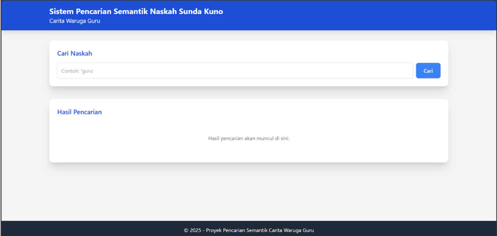
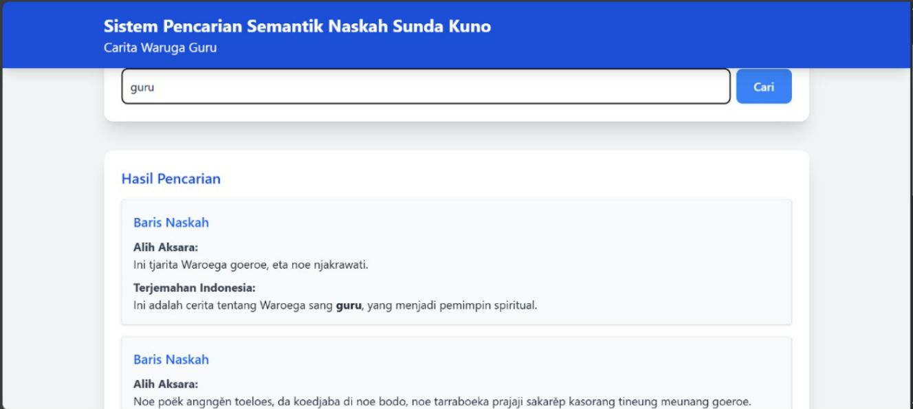

# Sistem Pencarian Semantik Naskah Sunda Kuno: Carita Waruga Guru

## Disusun Oleh

* **Candra Wibawa** – 140810220044
* **Muhammad Adzikra Dhiya Alfauzan** – 140810220046
* **Ivan Arsy Himawan** – 140810220052

## Deskripsi Proyek

Proyek ini merupakan implementasi sistem pencarian semantik untuk naskah kuno *Carita Waruga Guru*, menggunakan teknologi Semantic Web seperti RDF, OWL (Ontologi), dan SPARQL. Aplikasi ini memungkinkan pengguna mencari bagian naskah berdasarkan transliterasi atau terjemahan, dengan hasil yang ditampilkan secara terstruktur dan informatif.

Website yang dikembangkan terhubung langsung ke SPARQL endpoint dari Apache Jena Fuseki, memanfaatkan query semantik untuk pencarian data RDF.

---

## 📆 Struktur Proyek

```
carita-waruga-guru/
├── images/                  <- Asset README.md
├───└── tampilan_awal.png    
├───└── tampilan_pencarian.png
├── public/
├───└── index.html           <- Antarmuka utama aplikasi web
├── ontologi_CWG.ttl         <- File RDF/OWL (ontologi naskah)
├── package.json             <- Keperluan server
├── README.md                <- File dokumentasi ini
├── server.js                <- Keperluan server
└── requirements.txt         <- Daftar dependensi eksternal
```

---

## ⚙️ Panduan Instalasi

### 1. Instalasi Apache Jena Fuseki

1. Download Apache Jena Fuseki dari [https://jena.apache.org/download/index.cgi](https://jena.apache.org/download/index.cgi)
2. Ekstrak ke direktori, contoh: `D:\app\apache-jena-fuseki-5.4.0`
3. Jalankan Command Prompt dan ketik:

   ```bash
   fuseki-server
   ```
4. Akses web interface di `http://localhost:3030/`

### 2. Setup Dataset dan Upload RDF

1. Klik tab **Manage** → **New Dataset**
2. Nama: `carita-waruga-guru`
3. Tipe: `Persistent (TDB2)`
4. Upload file `ontologi_CWG.ttl` ke graph name:

   ```
   http://carita-waruga-guru
   ```

### 3. Jalankan Aplikasi Web

1. Clone atau download repositori:

   ```bash
   git clone https://github.com/MAdzikra/carita-waruga-guru.git
   ```
2. Buka file `index.html` di browser (Chrome/Firefox/Edge).
3. Masukkan kata kunci di form pencarian.

---

## 🥚 Panduan Pengguna

* Masukkan kata kunci pencarian (dalam transliterasi atau terjemahan).
* Sistem akan menampilkan hasil pencarian berdasarkan baris-baris naskah.
* Kata kunci akan disorot (highlighted) secara otomatis.
* Hasil ditampilkan secara real-time dari SPARQL endpoint lokal.

---

## 📸 Contoh Tampilan Website

### Tampilan Awal Website



### Tampilan Hasil Pencarian



---

## 🔎 Contoh Query SPARQL

```sparql
PREFIX aks: <http://aksarasunda.org/ontology#>

SELECT ?baris ?terjemahan ?transliterasi WHERE {
  GRAPH <http://carita-waruga-guru> {
    ?baris a aks:Baris ;
           aks:memilikiTerjemahan ?terjemahan ;
           aks:memilikiTransliterasi ?transliterasi .
  }
}
```

---

## 📚 Contoh RDF/Turtle

Ontologi lengkap proyek tersedia di GitHub:
📁 [`ontologi_CWG.ttl`](https://github.com/MAdzikra/carita-waruga-guru/blob/main/ontologi_CWG.ttl)

---

## 💻 Kebutuhan Sistem

* Apache Jena Fuseki 5.4.0+
* Browser modern (Chrome, Firefox, Edge)
* File RDF Turtle (.ttl)
* SPARQL endpoint aktif di `http://localhost:3030/carita-waruga-guru/query`

---

## Lisensi

Proyek ini bersifat open-source dan hanya digunakan untuk keperluan edukatif dalam mata kuliah Semantik Web Universitas Padjadjaran.

---
